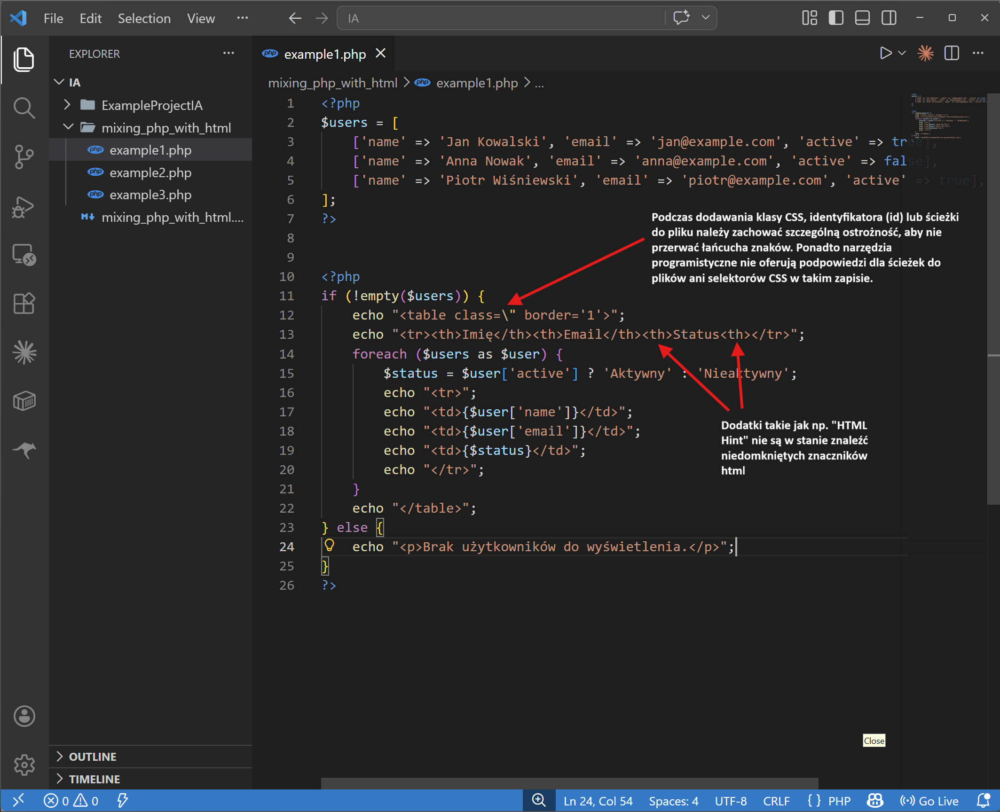
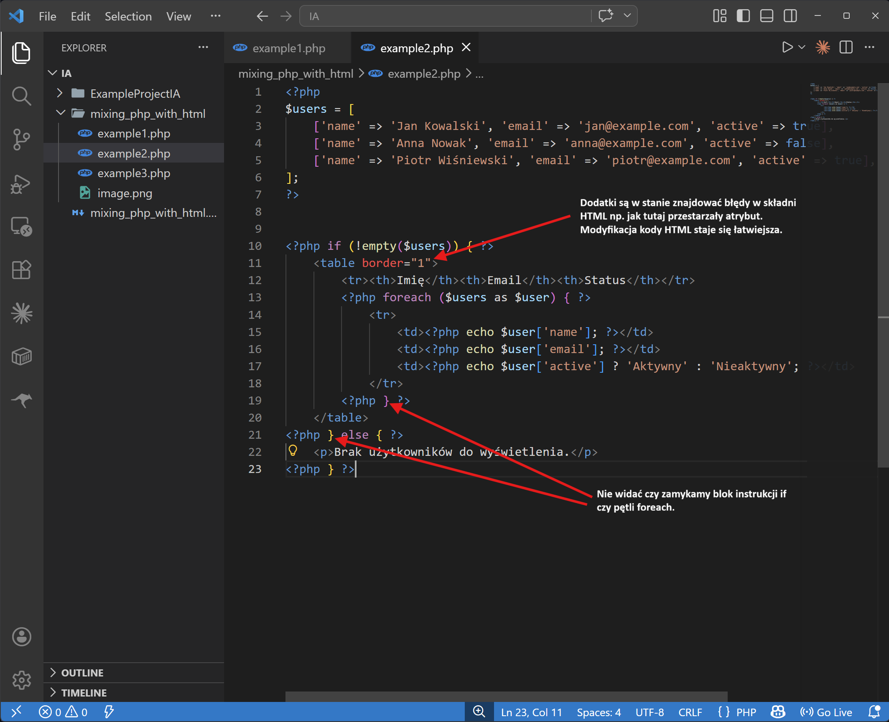
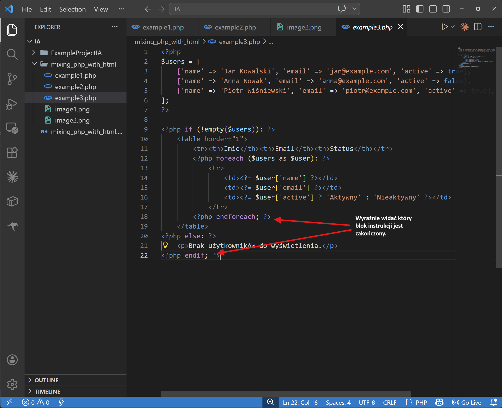

Kod PHP często jest mieszany z kodem HTML. Poniżej znajduje się przykład generowania tabeli użytkowników, zrealizowany na trzy różne sposoby, co pozwala dostrzec różnice w czytelności i podejściu do kodu:

## Przykład: Lista użytkowników
W poniższym przykładzie generujemy tabelę z danymi użytkowników. Jeśli lista jest pusta, wyświetlamy odpowiedni komunikat. Ten przykład najlepiej pokazuje, dlaczego alternatywna składnia (Sposób 3) jest najbardziej czytelna przy dużych fragmentach HTML.

```php
<?php
$users = [
    ['name' => 'Jan Kowalski', 'email' => 'jan@example.com', 'active' => true],
    ['name' => 'Anna Nowak', 'email' => 'anna@example.com', 'active' => false],
    ['name' => 'Piotr Wiśniewski', 'email' => 'piotr@example.com', 'active' => true],
];
?>
```

### Porównanie metod na przykładzie warunków i pętli:

#### Sposób 1 (Cały blok w `echo`)
Wszystkie tagi są wewnątrz stringów, co przy tabelach z warunkami staje się bardzo nieczytelne.
```php
<?php
if (!empty($users)) {
    echo "<table border='1'>";
    echo "<tr><th>Imię</th><th>Email</th><th>Status</th></tr>";
    foreach ($users as $user) {
        $status = $user['active'] ? 'Aktywny' : 'Nieaktywny';
        echo "<tr>";
        echo "<td>{$user['name']}</td>";
        echo "<td>{$user['email']}</td>";
        echo "<td>{$status}</td>";
        echo "</tr>";
    }
    echo "</table>";
} else {
    echo "<p>Brak użytkowników do wyświetlenia.</p>";
}
?>
```

W pierwszym sposobie cały kod znajduje się wewnątrz jednego dużego bloku PHP. Wszystkie znaczniki HTML są traktowane jako ciągi znaków (stringi) i wyświetlane przy pomocy instrukcji `echo` lub `print`. 

**Cechy tego podejścia:**
* **Czytelność**: Przy dużej ilości kodu HTML staje się on trudny do czytania i edytowania (brak kolorowania składni HTML wewnątrz stringów).
* **Brak wsparcia IDE (VS Code)**: Rozszerzenia nie będą podpowiadać błędów w składni HTML (np. niedomkniętych znaczników). Edytor nie zasugeruje również klas CSS ani ścieżek do plików (np. obrazków).


*Zwróć uwagę, że w powyższym kodzie celowo umieszczono błędy HTML (niepoprawny atrybut `class=\"` oraz niedomknięty tag `<th>Status<th>`), jednak edytor nie zgłasza żadnego ostrzeżenia, traktując to jako zwykły tekst.*

#### Sposób 2 (Mieszanie bloków `{ }`)
Widzimy już strukturę HTML, ale duża ilość nawiasów klamrowych `<?php } ?>` może prowadzić do pomyłek.
```php
<?php if (!empty($users)) { ?>
    <table border="1">
        <tr><th>Imię</th><th>Email</th><th>Status</th></tr>
        <?php foreach ($users as $user) { ?>
            <tr>
                <td><?php echo $user['name']; ?></td>
                <td><?php echo $user['email']; ?></td>
                <td><?php echo $user['active'] ? 'Aktywny' : 'Nieaktywny'; ?></td>
            </tr>
        <?php } ?>
    </table>
<?php } else { ?>
    <p>Brak użytkowników do wyświetlenia.</p>
<?php } ?>
```

W drugim sposobie przerywamy blok PHP, gdy chcemy wyświetlić standardowy kod HTML. Dzięki temu zyskujemy lepszą czytelność i wsparcie edytora (podświetlanie składni HTML).

**Cechy tego podejścia:**
* **Czytelność**: Kod HTML jest oddzielony od logicznych operacji PHP, co ułatwia pracę nad warstwą wizualną.
* **Logika w blokach**: Konstrukcje takie jak pętle czy instrukcje warunkowe są otwierane w jednym bloku `<?php ... { ?>` i zamykane w innym `<?php } ?>`.

> [!CAUTION]
> **Problem z czytelnością**: W Sposobie 2 bardzo ciężko jest jednoznacznie stwierdzić, który nawias zamykający `<?php } ?>` kończy instrukcję `if`, a który pętlę `foreach`. Przy wielu zagnieżdżeniach kod staje się bardzo podatny na błędy.


*Mimo poprawnego kolorowania kodu HTML, nagromadzenie bloków zamykających `<?php } ?>` utrudnia szybką analizę logiki warunków i pętli.*

#### Sposób 3 (Składnia alternatywna - najbardziej czytelna)
Kod jest najbardziej przejrzysty, łatwo dostrzec gdzie zaczynają i kończą się pętle i warunki.
```php
<?php if (!empty($users)): ?>
    <table border="1">
        <tr><th>Imię</th><th>Email</th><th>Status</th></tr>
        <?php foreach ($users as $user): ?>
            <tr>
                <td><?= $user['name'] ?></td>
                <td><?= $user['email'] ?></td>
                <td><?= $user['active'] ? 'Aktywny' : 'Nieaktywny' ?></td>
            </tr>
        <?php endforeach; ?>
    </table>
<?php else: ?>
    <p>Brak użytkowników do wyświetlenia.</p>
<?php endif; ?>
```

W trzecim sposobie korzystamy z **alternatywnej składni PHP**, która została zaprojektowana specjalnie z myślą o szablonach (widokach). Zamiast nawiasów klamrowych używamy dwukropka (`:`) do otwierania bloków oraz dedykowanych instrukcji zamykających (np. `endfor;`, `endif;`, `endforeach;`).

**Cechy tego podejścia:**
* **Najwyższa czytelność**: Kod wygląda bardzo czysto, a instrukcje zamykające (np. `endforeach`, `endif`) wyraźnie wskazują, która konstrukcja się kończy. Nie ma wątpliwości, co do czego przynależy.
* **Pełne wsparcie IDE (VS Code)**: Ponieważ kod HTML znajduje się poza blokami PHP, edytor i rozszerzenia oferują pełne wsparcie: podświetlanie składni, wykrywanie błędów (np. brakujących domknięć tagów), podpowiadanie klas CSS oraz ścieżek do plików.
* **Shorthand Echo (`<?=`)**: Używamy skróconego zapisu `<?= ... ?>` zamiast pełnego `<?php echo ... ?>`, co jeszcze bardziej skraca kod i poprawia czytelność.
* **Zastosowanie**: Jest to standard w nowoczesnych systemach szablonów i MVC (np. Laravel Blade, Pure PHP templates).


*Składnia alternatywna łączy zalety pełnego podświetlania składni HTML w edytorze z czystą dokumentacją przepływu sterowania (czytelne `endif` oraz `endforeach`).*

## Podsumowanie
Wybór odpowiedniej metody zależy od skomplikowania kodu. W prostych skryptach Sposób 1 może być wystarczający, jednak w profesjonalnych projektach i systemach szablonów dąży się do maksymalnej czytelności, którą najlepiej zapewnia **Sposób 3** (składnia alternatywna). Pozwala on na łatwe oddzielenie logiki biznesowej od warstwy prezentacji.
