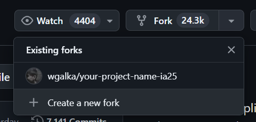
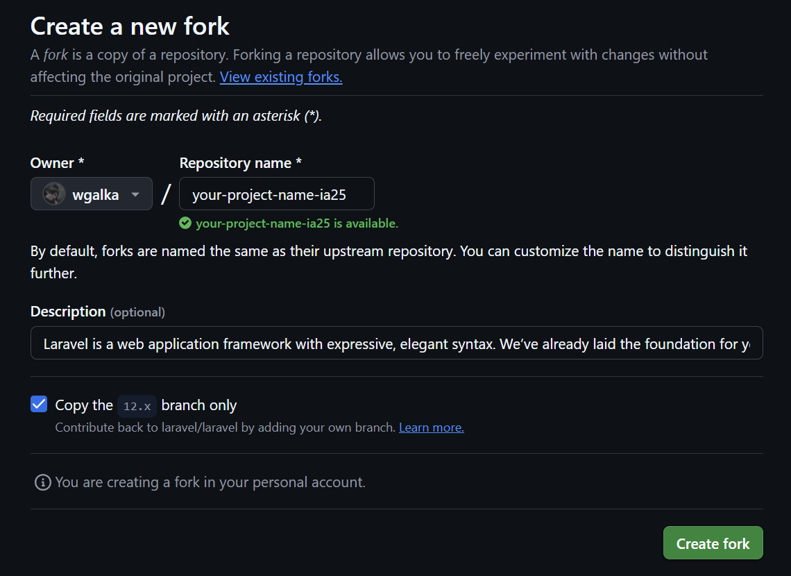
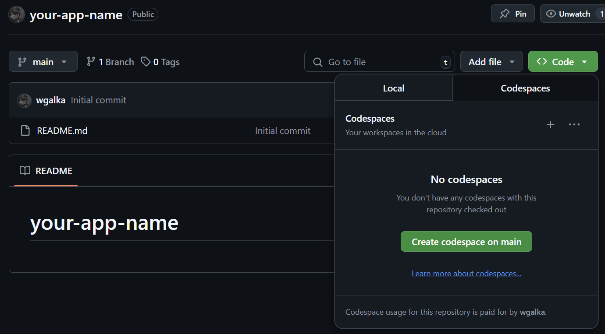
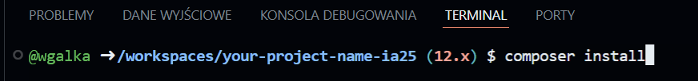
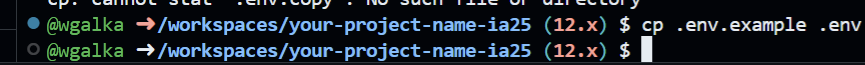
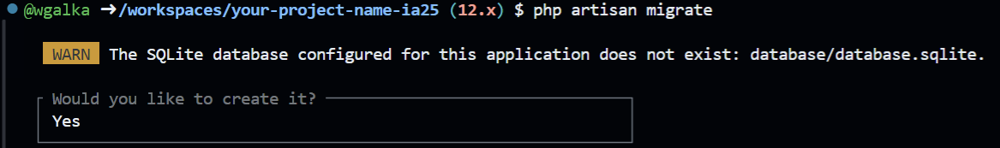
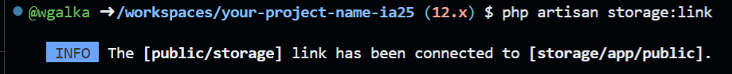
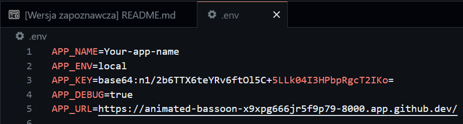
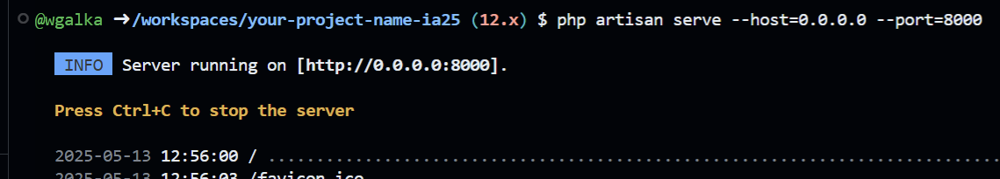

# How create laravel project on github

## Step 1: Create github account

1. Go to [https://github.com](https://github.com)
2. Click **Sign up**
3. Fill in:
   - Username
   - Email
   - Password
4. Verify your account and complete registration

## Step 2
1. Go to [https://github.com/laravel/laravel](https://github.com/laravel/laravel)
2. Click **Fork** > **Create a new fork**

3. Provide **Repository name** – e.g., `ridesharing-app-ia2025`

4. Click **Create fork**


## Step 3: Open the Repository in Codespaces
1. On your repository page click `<> Code`
2. Click **Create codespace on main** 

## Step 4: Create empty laravel project

1. In terminal run `composer install` to install php dependencies

2. Create `.env` file from `.env.example` (copy .env.example and rename it to .env)

3. Create database `php artisan migrate` (.env by default use sqlite. If you want to use another database change .env file first)

4. Generate APP_KEY `php artisan key:generate:

5. Generate public storage link:

4. Change `.env` settings:
    - APP_NAME, 
    - APP_URL, (to get app url go to step X)
    - Other settings (optional)
    

## Step 5: Run application

1. Run command `php artisan serve --host=0.0.0.0 --port=8000`



## Step 6: After modifying project apply changes to the repository

1. **Check for changes**:
   ```bash
   git status
   ```
2. Stage changes:
    - To add all changes:
    ```
    git add .
    ```
    - To add specific files:
    ```
    git add filename1 filename2
    ```
3. Commit changes:
    ```
    git commit -m "Describe your changes"
    ```
4. Push changes to GitHub:
    ```
    git push origin main
    ```
    or `git push`
 


